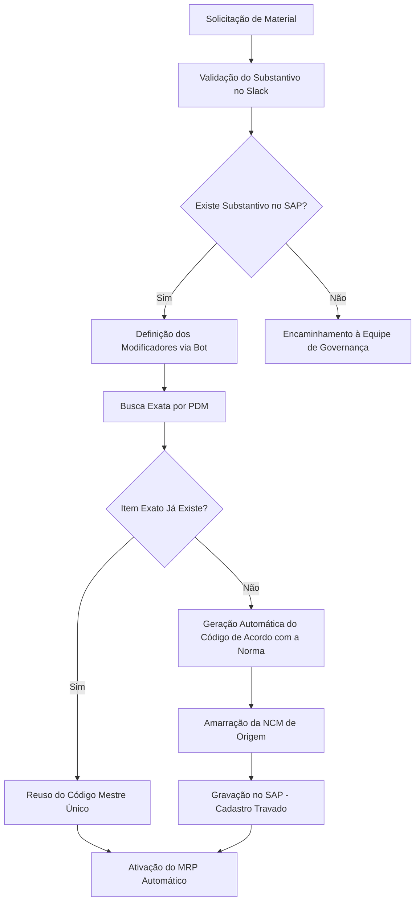

# Guia Executivo — Projeto Kaizen K30
## Reestruturação Logística e Governança Cadastral — Eletromidia S.A.

Este documento consolida todas as diretrizes, diagnósticos, tabelas comparativas, fluxos de governança e a proposta da solução inteligente **K30-BOT** de cadastro de materiais sob a norma **ISO 8000** e **ISO 55000**.

---

## 1. Visão Geral do Projeto

### O Objetivo Estratégico
Reestruturação logística e governança cadastral do MUBI Nacional no SAP sob as normas globais de qualidade de dados **ISO 8000** e o **Padrão de Descrição de Materiais (PDM)**.

### Indicadores Chaves (KPIs) Operacionais
A auditoria programática detalhada realizada na base corporativa do SAP revelou os seguintes números em Junho de 2026:

*   **Total de Itens Auditados:** `14.799` (Base completa extraída em Junho/2026)
*   **Cadastros Ativos:** `10.276` (Representa 69,44% do total de itens)
*   **Duplicidades Ativas:** `1.561` (Linhas com descrição idêntica gerando redundâncias de estoque)
*   **Nomenclaturas Corretas (Fórmula PDM):** `< 10%` (Itens que seguem estritamente a estrutura taxonômica validada)

---

### Os Três Pilares de Segurança de Estoque

1.  **Inventário Preciso:** Redução drástica de desperdícios eliminando códigos duplicados. Um único código mestre realimenta as transações de controle do almoxarifado físico.
2.  **Reposição via MRP:** O SAP monitora níveis críticos de insumos automaticamente, gerando solicitações de compras pré-estruturadas baseadas em especificações técnicas unificadas.
3.  **Blindagem Fiscal:** Alinhamento com a classificação fiscal correta na origem (NCM) para prevenir riscos, atrasos de transporte e retrabalhos na recepção de mercadorias.

---

### Padrão de Descrição de Materiais (PDM — ISO 8000)
A normatização de novos cadastros de materiais bloqueia a inserção de texto livre arbitrário no SAP, aplicando de forma automática a fórmula sintática abaixo:

```text
[SUBSTANTIVO], [MODIFICADOR 1], [MODIFICADOR 2], ..., [FABRICANTE/MODELO], [ESPECIFICAÇÕES]
```

#### Benefícios Imediatos:
*   **Prevenção de cadastros em lote com descrições redundantes** (Ex: 'Parafuso', 'Par. Sext.').
*   **Sustentabilidade para a trava anti-duplicação** automatizada em canais de chat.
*   **Apoio integral à fabricação interna** de ativos de engenharia do MUBI Nacional.

---

## 2. Diagnóstico Analítico da Base de Itens

Resultados consolidados da auditoria programática detalhada executada sobre os 14.799 itens extraídos da base do SAP:

### Status Cadastral Geral
*   **Itens Ativos:** `10.276 (69.4%)`
*   **Itens Inativos:** `4.523 (30.6%)`
*   *Nota Executiva:* O alto volume de itens inativos reflete históricos obsoletos de compras que devem ser segregados da base ativa alimentadora do ERP.

### Conformidade Taxonômica (Por Amostra de Categorias)
*   **Categoria Parafusos (Fora do Padrão):** `294 de 326 (90.2%)`
*   **Categoria Monitores (Fora do Padrão):** `492 de 566 (87.0%)`
*   *Nota Executiva:* A maior parte dos desvios decorre de cadastros livres manuais com uso inconsistente de caixa alta/baixa, ausência de vírgulas delimitadoras de atributos e excesso de termos poluentes.

---

### Gargalo Crítico: Duplicidades Ativas Multi-Grupo
O maior desvio estrutural identificado na base de dados é a presença de **825 descrições idênticas ativas** que geram **1.561 códigos redundantes ativos**. Esse desvio atravessa os prefixos cadastrais corporativos.

| Descrição Idêntica Ativa | Custo do Processo | Códigos SAP Duplicados | Grupo no ERP | Status do Item |
| :--- | :--- | :--- | :--- | :--- |
| **MULTIMETRO DIGITAL** | Alto Impacto Logístico | `FEA0042` / `FEA1554` | BENS PEQUENO VALOR | **Ativo** |
| **MULTIMETRO DIGITAL** | Alto Impacto Logístico | `MEC0608` / `MEC1001` | OPEX - ESTOQUE | **Ativo** |
| **MAQUINA NUC (ELETROMIDIA BACKUP)** | Redundância de CAPEX | `MEC0006` / `MEC0527` / `MEC0809` | CAPEX - ESTOQUE | **Ativo** |
| **MAQUINA NUC (ELETROMIDIA BACKUP)** | Redundância de CAPEX | `MEC0886` | OPEX - ESTOQUE | **Ativo** |

---

## 3. Fluxo Futuro de Governança Cadastral

O fluxograma abaixo detalha a estrutura organizacional do canal integrado para novos cadastros e ativação de reposição inteligente:



---

## 4. Tabela Comparativa Cadastral (Antes vs. Depois)

Análise demonstrativa direta comparando a base legada não padronizada com o modelo futuro saneado sob o Padrão PDM:

### 4.1 Categoria: Parafusos
| Código SAP | Descrição Legada (Antes) | Diagnóstico da Falha | PDM Proposto (Depois) | NCM Saneada | Ação Recomendada |
| :--- | :--- | :--- | :--- | :--- | :--- |
| `MEO0466` | PARAFUSO CABEÇA CHATA PHILIPS - M5X45mm | Caixa baixa parcial, delimitador incorreto (traço) e unidade duplicada (mm). | **PARAFUSO, CABECA CHATA, PHILIPS, M5X45, ACO CARBONO** | `7318.15.95` | **Padronizar** |
| `MEO0469` | PARAFUSO PHILIPS  6MM | Espaçamento duplo redundante, caixa baixa e falta do modificador de cabeça. | **PARAFUSO, FLANGEADO, PHILLIPS, M6, ZINCADO** | `7318.15.95` | **Padronizar** |
| `MEO0471` | PARAFUSO SEXTAVADO 10MM | Item físico duplicado na base legado, sem especificação de material. | **PARAFUSO, SEXTAVADO, M10, ACO GALVANIZADO** | `7318.15.95` | **Unificar Mestre** |

### 4.2 Categoria: Monitores
| Código SAP | Descrição Legada (Antes) | Diagnóstico da Falha | PDM Proposto (Depois) | NCM Saneada | Ação Recomendada |
| :--- | :--- | :--- | :--- | :--- | :--- |
| `MEC0021` | MONITOR 15 - LG Botão Lateral | Caixa baixa parcial, poluição por termo informal ("Botão Lateral"). | **MONITOR, LCD, 15 POLEGADAS, LG, L15W** | `8528.59.20` | **Padronizar** |
| `MEC0032` | MONITOR 17 - LG L1742S (Botão Lateral) | Uso de caracteres especiais irrelevantes, redundância de especificações secundárias. | **MONITOR, LCD, 17 POLEGADAS, LG, L1742S** | `8528.59.20` | **Padronizar** |

### 4.3 Categoria: Equipamentos & Automação
| Código SAP | Descrição Legada (Antes) | Diagnóstico da Falha | PDM Proposto (Depois) | NCM Saneada | Ação Recomendada |
| :--- | :--- | :--- | :--- | :--- | :--- |
| `MEC1175` | SWITCH SF 800 Q + 8 PORTAS FAST ETHERNET 10/100 | Duplicidade direta de item físico com cadastro redundante sob o mesmo fornecedor. | **SWITCH, FAST ETHERNET, 8 PORTAS, INTELBRAS, SF 800 Q** | `8517.62.55` | **Manter Mestre** |
| `MEC1248` | SWITCH 8 PORTAS FAST ETHERNET – INTELBRAS SF 800 | Redundância de descrição física ativa no SAP do mesmo switch. | **SWITCH, FAST ETHERNET, 8 PORTAS, INTELBRAS, SF 800 Q** | `8517.62.55` | **Unificar Mestre** |
| `FEA0042` | MULTIMETRO DIGITAL | Falta extrema de detalhamento técnico de marca, modelo e categoria de proteção. | **MULTIMETRO, DIGITAL, PORTATIL, CAT III, MINIPA, ET-1002** | `9030.33.19` | **Manter Mestre** |
| `FEA1554` | MULTIMETRO DIGITAL | Duplicidade idêntica ativa do multímetro do mesmo almoxarifado. | **MULTIMETRO, DIGITAL, PORTATIL, CAT III, MINIPA, ET-1002** | `9030.33.19` | **Unificar Mestre** |

---

## 5. Simulador de Governança no Slack

Para demonstrar a barreira de entrada inteligente (Trava de Cadastro) que previne a poluição de dados no SAP, um assistente virtual operando no Slack conversa com os compradores. 

### Fluxo de Diálogo Demonstrativo (Cadastro de Parafuso):

1.  **Usuário inicia:** `@k30bot novo cadastro`
2.  **Bot responde:** *"Bem-vindo ao canal integrado de Governança de Cadastros (MDM) do Kaizen K30. Eu sou o seu bot assistente da norma ISO 8000 para validação, saneamento e bloqueio de duplicações."*
3.  **Bot pergunta:** *"Por favor, selecione ou digite o tipo de cabeça/fenda (Modificador 1):"*
    *   *Opções:* `Cabeça Sextavada`, `Cabeça Chata Philips`, `Cabeça Panela`
4.  **Usuário seleciona:** `Cabeça Sextavada`
5.  **Bot pergunta:** *"Modificador 1 registrado. Agora insira ou escolha o diâmetro e rosca (Modificador 2):"*
    *   *Opções:* `M8X40`, `M10X25`, `M5X45`
6.  **Usuário seleciona:** `M8X40`
7.  **Bot pergunta:** *"Modificador 2 registrado. Defina agora o material e tratamento de superfície (Especificação):"*
    *   *Opções:* `Inox Aço A2`, `Aço Carbono Galvanizado`, `Aço Zincado`
8.  **Usuário seleciona:** `Inox Aço A2`
9.  **Bot processa e propõe:**
    *   *Código de PDM:* `PARAFUSO, SEXTAVADO, M8X40, INOX A2`
    *   *NCM Vinculada:* `7318.15.95`
10. **Validação Automática de Duplicidade:** O bot realiza uma busca semântica na base e confirma: *"Nenhum código similar ativo com esta combinação de PDM. Item liberado para gravação no SAP!"*
11. **Homologação:** O usuário confirma e o sistema retorna: *"Sucesso! Cadastro homologado sob o código único `MEO4082` no SAP."*

---

## 6. Apresentação Executiva — Projeto K30-BOT
### Chatbot Inteligente de Cadastro de Itens | Eletromidia S.A.

**Destinatários:** Departamentos Fiscal e Compras  
**Objetivo:** Apresentar o novo sistema de cadastro assistido por IA que elimina erros fiscais, duplicidades de estoque e compras emergenciais.

---

### 6.1 O Problema que Resolvemos

Atualmente, a base de dados do SAP da Eletromidia sofre com erros sistemáticos na criação de novos itens de estoque e OPEX, impactando diretamente os resultados financeiros:

*   **Cadastros livres sem padrão (ex: "Parafuso", "Par. Sext."):** Gera NCMs ausentes ou errados na origem, provocando multas recorrentes e retenção de cargas fiscais. Compras acaba criando códigos idênticos duplicados.
*   **Inserção de texto livre no ERP:** Inviabiliza a validação tributária prévia e confunde a equipe técnica em campo, que solicita peças incorretas.
*   **Compras fora do portal oficial:** Entrada de mercadorias sem classificação legal padrão, elevando os custos de frete emergencial de última hora.
*   **Falta de rastreabilidade cadastral:** Total impossibilidade de auditar o ciclo de vida dos ativos tributários e programar rotinas automáticas de reposição (MRP).

---

### 6.2 Os Três Pilares de Segurança Cadastral do K30-BOT

#### Pilar 1: Poka-Yoke (Processo Blindado Anti-Erro)
A metodologia Poka-Yoke impede o usuário de cometer um erro de classificação antes que o dado seja gravado na base de dados ativa do SAP:
*   **Campos obrigatórios com máscara sintática:** O bot rejeita qualquer entrada de dados que fuja do padrão textual.
*   **Validação em lote anti-duplicidade:** Busca equivalências semânticas no banco de dados ativo do SAP antes de liberar um novo código.
*   **Vínculo rígido de NCM:** Associa de forma indissolúvel a classificação tributária padrão no ato de criação.
*   **Fórmula PDM Obrigatória:** Exige conformidade com a taxonomia ISO 8000.

#### Pilar 2: Inteligência Artificial Avançada (Gemini AI)
A Inteligência Artificial Generativa do Google (Gemini) auxilia os colaboradores na decodificação de termos livres e autocompleta atributos complexos:
*   **Autocompletar Descrições:** Usuário insere `monitor 21 polegadas` -> Gemini sugere `MONITOR, LCD, 21.5 POLEGADAS, POSITIVO MASTER`.
*   **Sugestão Autônoma de NCM:** Identifica o material e sugere o NCM correspondente em segundos (Ex: `8528.59.20`).
*   **Análise de Similaridade Semântica:** Alerta o usuário caso já existam peças compatíveis no almoxarifado físico.
*   **Classificação Automatizada:** Aloca o novo item automaticamente na respectiva família técnica do ERP.

#### Pilar 3: Governança sob as Normas ISO 8000 & ISO 55000
Garante a qualidade de dados mestre logísticos e contábeis de acordo com normas globais de excelência:
*   **Sintático (ISO 8000):** Padronização do formato (letras maiúsculas e separadores vírgula). Alinha a estrutura de ativos na árvore de manutenção da **ISO 55000**.
*   **Semântico (ISO 8000):** Significado único para cada substantivo, otimizando o tempo gasto pela manutenção de campo localizando peças equivalentes.
*   **Pragmático (ISO 8000):** Dados plenamente úteis que ativam rotinas automáticas de reposição do SAP (MRP) com segurança total.

---

### 6.3 Arquitetura de TI em Linguagem de Negócio

Toda a infraestrutura do K30-BOT é hospedada de forma segura, escalável e resiliente na nuvem **Google Cloud Platform (GCP)**:

*   **Slack Interface:** Ambiente conversacional que a equipe já utiliza diariamente, dispensando treinamentos de módulos do ERP.
*   **Cloud Run:** O cérebro executivo do bot, executando regras de negócio e validações fiscais sem custo fixo de servidores ligados ociosos (Serverless).
*   **Vertex AI (Gemini):** O motor de inteligência artificial responsável por processar linguagem natural e classificar dados logísticos.
*   **Cloud Firestore:** Banco NoSQL de alta performance que guarda os esquemas de PDM e regras tributárias de NCM.
*   **Cloud Tasks:** Fila de mensagens assíncrona que garante resiliência e previne perdas de solicitações durante picos de tráfego.
*   **Secret Manager:** Cofre seguro de chaves de API, credenciais do Slack e chaves de acesso ao SAP.

---

### 6.4 Benefícios Diretos do K30-BOT

#### Para o Departamento Fiscal:
*   **Antes:** NCMs ausentes ou errados em cerca de 30% dos itens, gerando multas, barreiras e retenções em transporte fiscal.
*   **Depois:** NCM vinculado na origem tributária. Saneamento preventivo que zera o retrabalho e protege a Eletromidia contra fiscalizações da Receita Federal.

#### Para o Departamento de Compras:
*   **Antes:** De 3 a 10 códigos para o mesmo parafuso, inflando estoque ocioso e forçando compras de emergência desnecessárias.
*   **Depois:** Um único código mestre. Saneamento preventivo que ativa automaticamente o MRP no SAP, reduz custos de CAPEX e diminui o tempo de espera do técnico de campo.

---

### 6.5 Rastreabilidade Avançada e Data Lineage

O sistema armazena uma trilha de auditoria imutável (Data Lineage) para cada código mestre criado no SAP, coletando na origem:
1.  **Identificação do Autor:** Responsabilização individual e auditoria de acessos.
2.  **Timestamp Completo:** Registro preciso de data e hora para acompanhamento de obsolescência técnica.
3.  **Tabela de Correlação (De-Para):** Migração segura do catálogo de dados antigos.
4.  **Histórico de Alterações:** Auditoria integral do ciclo de vida regulatório do ativo tributário.

> *"Em caso de fiscalização tributária da Receita Federal, a Eletromidia comprova em segundos o motivo técnico da escolha de cada NCM, quem validou e a justificativa técnica. O resultado é um processo de defesa ágil, incontestável e embasado."*

---

### 6.6 Kitting e MRP na Prática Operacional

#### O Conceito de Kitting
A unificação cadastral viabiliza a criação de kits fechados de materiais no almoxarifado de acordo com a Ordem de Serviço, otimizando as saídas de campo.

**Exemplo: Kit de Instalação de Painel OOH**
*   `PARAFUSO, SEXTAVADO, M8X40, INOX` (8 un)
*   `BUCHA, PLASTICA, 10MM` (8 un)
*   `ELETRODUTO, GALVANIZADO, 1 POL` (2 m)
*   `MONITOR, LCD, 21.5 POLEGADAS, POSITIVO, MASTER` (1 un)
*   `MODEM, CELULAR, ELSYS, VIVO, 4G + ANTENAS` (1 un)
*   `CABO, HDMI, 2 METROS, PREMIUM` (2 un)

#### Ativação do MRP Automático no SAP
A integridade dos códigos mestre permite configurar parâmetros automáticos de reposição de estoque mínimos na base do ERP:
*   **Estoque Mínimo:** Dispara solicitações de reabastecimento automáticas.
*   **Lead Time:** Calcula o tempo logístico de entrega do fornecedor.
*   **Ponto de Ressuprimento:** Alerta preventivo nos relatórios de compras.
*   **Consumo Médio Projetado:** Otimiza a quantidade comprada, reduzindo custos de CAPEX.

---

### 6.7 Plano de Trabalho e Próximos Passos

O cronograma sequencial de rollout do K30-BOT no Slack corporativo da Eletromidia está estruturado da seguinte forma:

```text
Fase 1: Aprovação Conceitual (1 semana)
  - Aprovação do desenho arquitetural e alocação de orçamento da nuvem GCP.
  - Envolvidos: Patrocinador do Projeto + Comitê de TI.

Fase 2: Configuração de Infraestrutura (1 semana)
  - Criação das instâncias no GCP e integração inicial com banco de dados Firestore.
  - Envolvidos: Líder de Infraestrutura + Consultoria Kaizen.

Fase 3: Parametrização da IA (2 semanas)
  - Fine-tuning do Vertex AI (Gemini) alimentado com as regras taxonômicas PDM.
  - Envolvidos: Engenharia + Analistas Compras/Fiscal.

Fase 4: Lançamento do Piloto (2 semanas)
  - Rollout operacional do bot em canal restrito focando nos 50 itens de maior criticidade.
  - Envolvidos: Time Piloto Multidisciplinar.

Fase 5: Rollout Geral (1 mês)
  - Ativação geral do canal Slack para todos os compradores e equipes logísticas.
  - Envolvidos: Todos os Usuários Operacionais.

Fase 6: Governança Contínua (Permanente)
  - Rituais de auditoria de qualidade trimestrais e acompanhamento de KPIs.
  - Envolvidos: Comitê de Governança K30.
```

---

## 7. Solicitação de Aprovação Executiva

**Resumo Executivo para Tomada de Decisão:**

*   **O Quê:** Implementação de assistente virtual conversacional no Slack para guiar e validar a criação de códigos no SAP.
*   **Por Quê:** Erradicação definitiva de autuações tributárias, duplicidade em estoque de peças e custos extras com frete emergencial.
*   **Como:** Integração em tempo real de Inteligência Artificial Gemini, barreira técnica Poka-Yoke e taxonomia de dados ISO 8000.
*   **Onde:** Infraestrutura robusta hospedada de forma segura e serverless na nuvem Google Cloud Platform (GCP).
*   **Quando:** Cronograma estruturado em fases de validação com piloto pré-definido, iniciando por categorias de alta criticidade cadastral.
*   **Quanto:** Custo computacional sob demanda (Serverless). Investimento em infraestrutura de tecnologia atrelado diretamente ao uso.

### Os 5 Motivos Estratégicos para Aprovação Imediata:
1.  **Risco Fiscal Reduzido a Zero:** Vinculação robusta de NCM correto desde o cadastro mestre.
2.  **Estoque Físico Saneado:** Regra "uma peça física, um único código" prevenindo duplicidades e CAPEX ocioso.
3.  **Compras Previsíveis:** Alinhamento de consumo e acionamento de reposição via MRP automático do SAP.
4.  **Data Lineage Ativo:** Trilha de auditoria histórica transparente e inquestionável em minutos.
5.  **Eletromidia na Vanguarda:** Governança cadastral e física sob as rígidas normas ISO 8000 e ISO 55000.

> **"A qualidade dos dados é a qualidade da decisão."**  
> Com o K30-BOT, a Eletromidia garante que cada item de suprimentos cadastrado seja um ativo corporativo seguro e confiável — desde a sua entrada no SAP até a manutenção pesada em campo.
